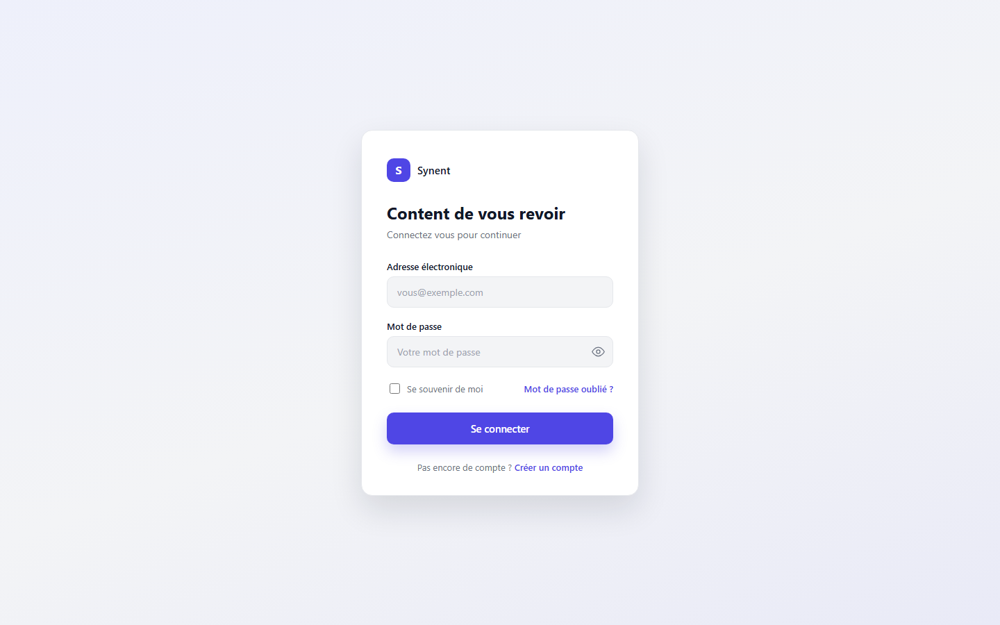
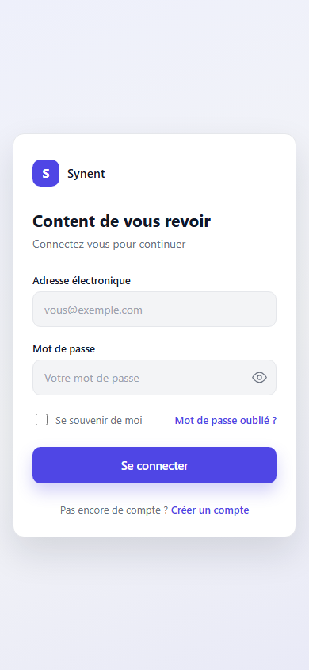

# Synent Task 3 : UI de page de connexion

## Objectif

Concevoir une interface de connexion epuree et moderne. Cette tache se concentre uniquement
sur le design et l alignement : il n y a pas de backend d authentification, le formulaire ne
fait qu illustrer les interactions attendues cote client (validation visuelle de l email et
affichage ou masquage du mot de passe).

## Stack

- HTML5
- CSS3
- JavaScript vanilla (toggle de visibilite du mot de passe et validation de l email)

## Fonctionnalites

- Champ Adresse electronique avec bordure rouge automatique si le format saisi est invalide
- Champ Mot de passe avec bouton oeil pour afficher ou masquer la saisie
- Bouton Se connecter avec des etats hover et focus distincts
- Lien Mot de passe oublie clairement visible
- Carte centree verticalement et horizontalement, avec ombre et bordure subtiles pour la
  profondeur
- Mise en page responsive : la carte reste lisible et centree sur mobile
- Palette de couleurs professionnelle limitee a l indigo, l encre foncee et le gris neutre

## Captures d ecran

### Desktop



### Mobile



## Lancer le projet

Aucune installation n est necessaire. Il suffit d ouvrir le fichier `index.html` dans un
navigateur.

```bash
open index.html
```

Sur Windows, un double clic sur `index.html` suffit egalement.
